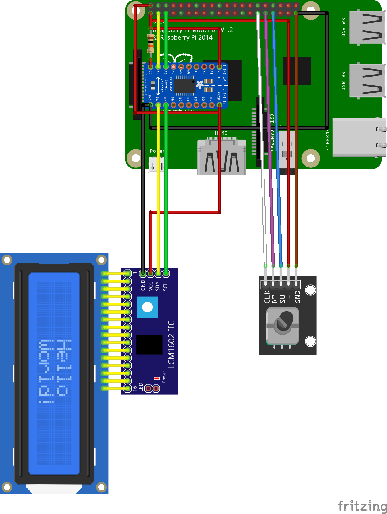

<h3>Radio Pi</h3>

<h4>Installation</h4>
<ul>
<li>sudo systemctl start radiopi</li>
<li>sudo systemctl start radiopi</li>  
</ul>
<h4>Update</h4>

<code>git -C /home/hara/radiopi/ pull https://github.com/HaraldRau/radiopi.git</code>

<h4>Nach Update</h4>

.git/hooks/post-merge

<code>sudo cp /home/hara/radiopi/config /home/hara/.moc/config</code>

<code>sudo cp /home/hara/radiopi/editplaylist /home/hara/.moc/editplaylist</code>

<code>sudo chmod +x /home/hara/.moc/editplaylist</code>

<h4>Dienste installieren</h4>

sudo cp /home/hara/radiopi/scripte/radiopi.service /etc/systemd/system/radiopi.service

systemctl --user daemon-reload

systemctl --user enable radiopi

systemctl --user start radiopi

<h4>moc Musik on Console</h4>
<h5>Befehle</h5>
<ul>
  <li>mocp -S Server starten</li>
  <li>mocp -c löscht die aktuelle Playliste</li>
  <li>mocp -a /pfad/zur/musik fügt das Verzeichnis zur aktuellen Playliste hinzu</li>
  <li>mocp -p spielt die aktuelle Playliste ab</li>
  <li>mocp -f spielt den nächsten Titel ab</li>
  <li>mocp -x beendet den Server</li>
  <li>mocp -h gibt die Hilfe aus</li>
</ul>
